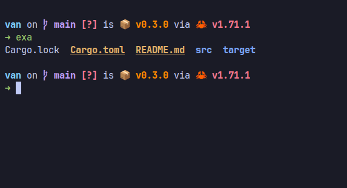

# van

Applies an arbitrary theme from [Gogh](https://gogh-co.github.io/Gogh/) to both [Black Box](https://gitlab.gnome.org/raggesilver/blackbox) and your default [GNOME Terminal](https://gitlab.gnome.org/GNOME/gnome-terminal) profile.



## Install

```sh
cargo install --path .
```

## Usage

```sh
van <THEME_NAME>
```

See [Gogh](https://gogh-co.github.io/Gogh/) for theme names.
