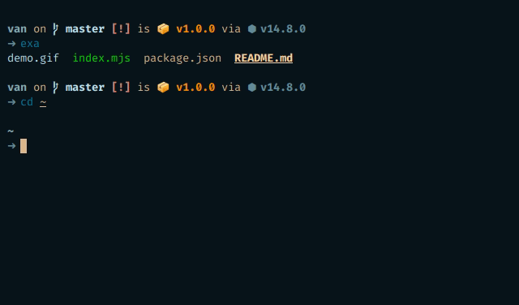

# Van

Applies arbitrary theme from [Gogh](https://mayccoll.github.io/Gogh/) to your default GNOME Terminal and Tilix profiles.



## Installation

### Option 1: Via GitHub Packages

_Requires you to authenticate to GitHub Packages: <https://docs.github.com/en/packages/working-with-a-github-packages-registry/working-with-the-npm-registry>_

```sh
npm install -g --registry=https://npm.pkg.github.com @operrathor/van
```

### Option 2: Manually

```sh
git clone https://github.com/operrathor/van.git && cd van
npm install -g
```

## Usage

```sh
van <theme>
```

Example:
```sh
van elementary
```

See [Gogh](https://mayccoll.github.io/Gogh/) for theme names.
